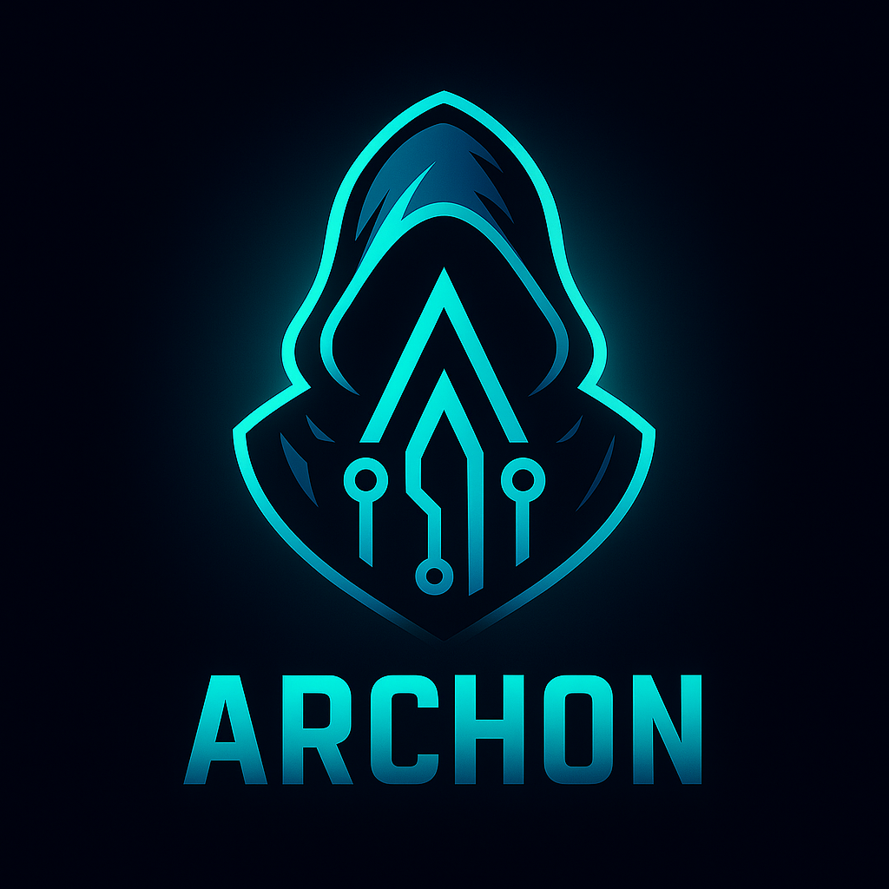

# 👽 Archon

<div align="center">
  
  
</div>

[](https://www.rust-lang.org)
[](https://developer.nvidia.com)
[](https://wayland.freedesktop.org)

**Archon** is a **sovereign web browser** forged in **Rust**, GPU-accelerated for **NVIDIA Linux**, and architected for a world of **crypto-native identity** and **agentic AI**.

It’s the next evolution of privacy browsers — *Brave meets Comet meets Ghost in the Shell* — minimal, fast, intelligent, and truly yours.

---

## ✨ Philosophy

* 🧘 **Minimal Zen UI** — distraction-free, fluid, GPU-accelerated.
* 🔐 **Privacy First** — hardened sandboxing, fingerprint resistance, tracker purge.
* 🪙 **Self-Sovereign Identity** — native ENS / Unstoppable Domains resolution.
* 🥬 **Crypto-Aware Address Bar** — resolve `eth:` / `btc:` / `ipfs:` URIs natively.
* ⚡ **NVIDIA-Optimized** — tuned WebRender pipeline and shader paths.
* 🧠 **Agentic AI** — your personal local+cloud assistant integrated right in the tab.

---

## 🧠 AI Integration

Archon is **LLM-aware** by design:

| Provider                             | Mode                  | Notes                                                    |
| ------------------------------------ | --------------------- | -------------------------------------------------------- |
| 🧬 **Ollama (Local)**                | via `localhost:11434` | GPU-accelerated inference on your RTX.                   |
| 🤖 **Claude / OpenAI / Gemini APIs** | cloud connectors      | Swappable, cost-aware agent router.                      |
| 🕹️ **Ghostctl Hooks**               | internal API          | For automation, system integration, and context sharing. |

Use **Archon Agents** to summarize pages, automate research, or run on-device inference — without ever leaving your machine.

---

## 🪙 Crypto-Native Features

* ✅ ENS + Unstoppable Domains resolution
* ✅ WalletConnect 2.0 bridge (Metamask / Rainbow / CKVault)
* ✅ Ethereum & Solana JSON-RPC bindings
* ✅ IPFS / Arweave gateway resolver
* 🔐 Local key-vault w/ hardware key support (YubiKey / Ledger)

---

## ⚙️ Architecture

| Layer           | Tech                                                |
| --------------- | --------------------------------------------------- |
| 🧠 Core Engine  | Rust + Servo (Async Tokio)                          |
| 🎨 UI Shell     | WGPU / Skia + Wayland native                        |
| 🔐 Networking   | `rustls`, `hickory-dns`, DoT > DoH fallback         |
| 🧱 Crypto Stack | `ethers-rs`, `solana-sdk`, `web3`                   |
| 🤩 AI Bridge    | Local Ollama socket + remote Claude/OpenAI API      |
| 🛠️ Tooling     | Integrates with `ghostctl`, `ghostdns`, `ghostmesh` |

---

## 🧩 Feature Matrix (2025 Roadmap)

| Feature                            | Status        |
| ---------------------------------- | ------------- |
| 🦀 Rust-based browser core         | ✅ In progress |
| 🎨 Wayland + WebRender GPU support | ✅ Core target |
| 🔒 DoT / DoH DNS resolver          | ✅ Implemented |
| 🥬 ENS / UD resolution             | ⚙️ WIP        |
| 🔏 Ad / Tracker blocking           | 🛠️ Planned   |
| 🧘 Zen-mode UI                     | 🛠️ Planned   |
| 🧠 LLM agent integration           | ⚙️ Prototype  |
| 🧹 Ghostctl CLI integration        | 🔜 Soon       |
| 📦 Flatpak + AppImage builds       | 🔜 Soon       |

---

## 🧮 Performance Goals

* **Zero-copy GPU pipeline** for DOM rendering.
* **NVENC/NVDEC** acceleration for media playback.
* Optimized for **Linux (Arch, Fedora, Debian)** first; macOS + Windows later.
* Native **Zig interop layer** under consideration for shader DSLs.

---

## 🔮 Vision 2026+

* 🦩 **Archon Agents Market** — plug-in AI personalities.
* 🕵️ **Ghost Mode Mesh Sync** — encrypted session replication via Headscale/Matrix.
* 🔒 **Crypto Paywall Bypass** — opt-in micropayments using zk-proofed tokens.
* 🦯 **Covenant Protocol** — verifiable browsing ethics layer.
* 🌌 **Archon OS** — full sovereign workspace environment.

---

## 🤝 Contributing

1. Clone the repo:

   ```bash
   git clone https://github.com/ghostkellz/archon.git
   cd archon
   cargo run
   ```
2. GPU dependencies (Arch Linux):

   ```bash
   sudo pacman -S vulkan-devel nvidia-open-dkms wayland libva rustup
   ```
3. Switch to nightly toolchain & build.
4. PR welcome for:

   * Wallet / ENS integration
   * LLM agent API router
   * DNS security enhancements
   * UI theme system (WGPU + CSS-like DSL)

---

## 📜 License

MIT License © 2025 [GhostKellz](https://ghostkellz.sh) / CK Technology

> **Archon** — *Power behind the screen.*

