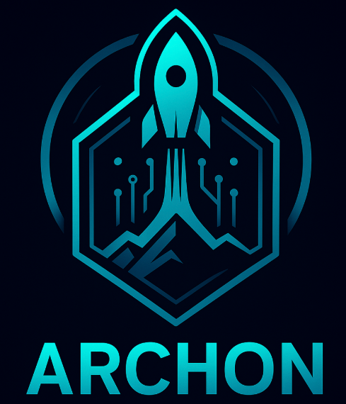

# 👽 Archon

<div align="center">
  
  
</div>

[](https://www.rust-lang.org)
[](https://developer.nvidia.com)
[](https://wayland.freedesktop.org)

**Archon** is a **sovereign web browser** forged in **Rust**, GPU-accelerated for **NVIDIA Linux**, and architected for a world of **crypto-native identity** and **agentic AI**.

## 🚀 Overview

It’s the next evolution of privacy browsers — *Brave meets Comet meets Arch Linux meets wayland native* — minimal, fast, intelligent, and truly yours.

## ✨ Philosophy

* 🧘 **Minimal Zen UI** — distraction-free, fluid, GPU-accelerated.
* 🔐 **Privacy First** — hardened sandboxing, fingerprint resistance, tracker purge.
* 🪙 **Self-Sovereign Identity** — native ENS / Unstoppable Domains resolution.
* 🥬 **Crypto-Aware Address Bar** — resolve `eth:` / `btc:` / `ipfs:` URIs natively.
* ⚡ **NVIDIA-Optimized** — tuned WebRender pipeline and shader paths.
* 🧠 **Agentic AI** — your personal local+cloud assistant integrated right in the tab.

---

## 🧠 AI Integration

Archon is **LLM-aware** by design:

| Provider                             | Mode                       | Vision | Audio | Notes                                                                  |
| ------------------------------------ | -------------------------- | :----: | :---: | ---------------------------------------------------------------------- |
| 🧬 **Ollama (Local)**                | via `localhost:11434`      |  ✅   |  ➖  | GPU-accelerated inference on your RTX (images supported via LLaVA).   |
| 🤖 **OpenAI**                        | REST (`chat/completions`)  |  ✅   |  ✅  | Set `OPENAI_API_KEY`, optional `OpenAI-Organization`/`OpenAI-Project`. |
| 🧠 **Anthropic Claude**              | REST (`v1/messages`)       |  ✅   |  ➖  | Set `ANTHROPIC_API_KEY`, override `anthropic-version` if needed.      |
| 🌈 **Google Gemini**                | REST (`generateContent`)   |  ✅   |  ✅  | Set `GEMINI_API_KEY`, Archon handles prompt scaffolding.              |
| 🚀 **xAI Grok**                      | REST (`chat/completions`)  |  ➖   |  ➖  | Set `XAI_API_KEY`, chats like OpenAI-compatible APIs.                 |
| 🕹️ r**Ghostctl Hooks**               | internal API               |  ➖   |  ➖  | For automation, system integration, and context sharing.              |

### Configurable AI bridge

AI providers now live in `~/.config/Archon/config.json` under the `ai` key. Each entry defines the endpoint, `kind`, default model, capability flags (`vision`/`audio`), and an optional `api_key_env`. Local Ollama is enabled out of the box; remote connectors stay disabled until you export keys, e.g. `export OPENAI_API_KEY=sk-...`.

> **New:** Archon’s AI bridge accepts inline image (`image/*`) and audio (`audio/*`) attachments. The native host, launcher CLI (`--chat ... --attach <file>`), and Chromium sidebar automatically enforce each provider’s declared capabilities so you can, for example, send screenshots to OpenAI/Gemini or voice notes once an audio-capable model is selected (8&nbsp;MiB per file, MIME auto-detected).

The Chromium sidebar now pulls its provider dropdown from the running host, so any `config.json` changes (enabling/disabling providers or tweaking capability flags) become available on the next reconnect without a code change.

Run `cargo run -- --diagnostics` to verify endpoints, API keys, the active default provider, and a live metrics snapshot (request counts, latency, last prompt/error) for each connector.


- `archon_host` now supports both HTTP (`archon-host --listen 127.0.0.1:8805`) and Chromium native messaging (`archon-host --stdio`). The AUR package installs native messaging manifests under `/etc/chromium/native-messaging-hosts/` and `/etc/opt/chrome/native-messaging-hosts/` so the browser can spawn the host automatically.
- A starter sidebar extension ships at `/usr/share/archon/extensions/archon-sidebar/` with a reproducible `archon-sidebar.zip` bundle alongside it. Load either artifact as an unpacked extension during development, or sign and distribute it with the embedded public key to preserve the deterministic ID (`ldcpmobkmncbffgkmjmnhlbnppkhmpii`).
- Chromium Max build tooling is packaged under `/usr/share/archon/tools/build/`. Invoke `/usr/share/archon/tools/build/chromium_max_build.sh` directly or copy it into a writable workspace; the matching GN args template lives at `/usr/share/archon/tools/build/args/chromium_max.gn`.
- When `ai_host.enabled` is set in `config.json`, the launcher will generate `providers.json` if missing and auto-start the `archon-host.service` user unit (with graceful fallback when systemd isn't available). Run `cargo run -- --diagnostics` to inspect the systemd state, or call `/usr/share/archon/tools/enable_archon_services.sh` to toggle the user services after packaging install.

### MCP tool connectors

Model Context Protocol connectors live under the top-level `mcp` key in `config.json`. Each connector entry defines a `name`, `kind`, `endpoint`, and optional `api_key_env`. Archon now:

- auto-runs `docker compose up -d` for sidecars when `mcp.docker.auto_start` is enabled;
- exposes connector health in `cargo run -- --diagnostics` and `/chat` host responses;
- serves `GET /connectors` and `POST /tool-call` from `archon-host`; and
- surfaces the catalogue inside the sidebar extension with JSON argument tooling.

Enable connectors like LangChain, n8n, or bespoke toolboxes by dropping them into `config.json` and exporting any required secrets. The sidebar will refresh the connector list on reconnect and let you invoke tools directly from the browser.


## 🪙 Crypto-Native Features

* ✅ ENS + Unstoppable Domains resolution
* ✅ WalletConnect 2.0 bridge (Metamask / Rainbow / CKVault)
* ✅ Ethereum & Solana JSON-RPC bindings
* ✅ IPFS / Arweave gateway resolver
* 🔐 Local key-vault w/ hardware key support (YubiKey / Ledger)

### Network orchestration

`CryptoStack` keeps an auditable registry of RPC endpoints (HTTP + WebSocket) and flags experimental networks or missing credentials. Extend the `crypto.networks` array in `config.json` to light up additional chains, rollups, or custom gateways.

---

## ⚙️ Architecture

| Layer           | Tech                                                |
| --------------- | --------------------------------------------------- |
| 🧠 Core Engine  | Rust + Servo (Async Tokio)                          |
| 🎨 UI Shell     | WGPU / Skia + Wayland native                        |
| 🔐 Networking   | `rustls`, `hickory-dns`, DoT > DoH fallback         |
| 🧱 Crypto Stack | `ethers-rs`, `solana-sdk`, `web3`                   |
| 🤩 AI Bridge    | Local Ollama socket + remote Claude/OpenAI API      |
| 🛠️ Tooling     | Integrates with `ghostctl`, `ghostdns`, `ghostmesh` |

## 🧭 Launcher CLI

The Rust launcher orchestrates engine binaries, profile state, AI providers, crypto endpoints, and Wayland preferences.

```bash
cargo run -- --diagnostics
```

Shows a full health report including engine discovery, AI providers, crypto networks, and Wayland availability. Use `--engine` / `--profile` / `--mode` to drive `archon-lite` (privacy focus) or `archon-edge` (AI/Web3) with per-profile storage.

Every executed launch now records a structured JSON-L trail (`sync/events.jsonl`) with session IDs, PIDs, exit codes, and durations. Tail it with `jq` or ship it into your observability stack for real-time telemetry.

```bash
cargo run -- --history          # show the 10 most recent sync events
cargo run -- --history 25       # show a larger tail
cargo run -- --transcripts      # list recent AI transcripts (default 10)
cargo run -- --transcripts 25   # show more stored conversations
cargo run -- --resolve vitalik.eth   # resolve ENS via the crypto stack
cargo run -- --resolve archon.nft    # resolve Unstoppable (requires API key)
cargo run -- --chat "status update"  # talk to the default AI provider (text-only)
cargo run -- --chat "summarize the screenshot" --attach /tmp/capture.png  # send an image
cargo run -- --chat "transcribe this" --attach /tmp/snippet.m4a --chat-provider openai   # audio + specific provider
cargo run -- --write-ghostdns-config # render GhostDNS TOML (pass --force to overwrite)
cargo run -- --write-ai-host-config  # render AI host providers JSON (pass --force to overwrite)
cargo run -- --sync-ghostdns-policy  # render GhostDNS + Chromium policy together (pass --force to overwrite)
```

Each entry includes phase, profile, engine/mode, execution state, PID, exit status, duration, and any error payload to streamline incident triage without leaving the terminal.

## 🌐 GhostDNS Daemon

`ghostdns` is a standalone sidecar that terminates secure DNS for Chromium Max and resolves crypto-native domains locally. On first launch it writes `ghostdns.toml` into your Archon config directory (unless the file already exists) and then starts listening for DoH traffic. When TLS material is provided it also accepts native DoT sessions, giving Chromium Max a dual-stack resolver out of the box.

- **DoH endpoint:** defaults to `https://127.0.0.1:443/dns-query` — configurable via `server.doh_listen` / `server.doh_path`.
- **DoT endpoint:** opt-in via `server.dot_listen` with `server.dot_cert_path`/`server.dot_key_path`; the PEM pair is loaded at boot and advertised over ALPN `dot` (RFC 7858).
- **DNS cache:** persisted to `~/.cache/archon/ghostdns.sqlite` with a 1 hour TTL (5 minutes for NXDOMAIN). Tweak via the `[cache]` stanza in `ghostdns.toml` or disable by removing `cache.path` / setting the TTLs to `0`.
- **Upstream fallback:** proxied to the `upstream.fallback_doh` URL when queries are outside crypto TLDs.
- **Metrics:** if `server.metrics_listen` is set (defaults to `127.0.0.1:9095`), a Prometheus scrape endpoint is exposed at `/metrics` with counters for local answers, upstream lookups, failures, cache hits, and cache misses.

```bash
cargo run --bin ghostdns -- --verbose
# override the TOML location (e.g. in a container volume)
cargo run --bin ghostdns -- --ghostdns-config /etc/archon/ghostdns.toml
```

Disable the metrics listener by removing or commenting `metrics_listen` in `ghostdns.toml`.

### Wayland-first engine tuning

Archon now inspects the active desktop session before every launch and automatically tunes each engine:

- **Archon Lite (Firefox)** — injects `MOZ_ENABLE_WAYLAND=1`, enables WebRender + VAAPI, and falls back to `GDK_BACKEND=x11` only when Wayland isn’t available.
- **Archon Edge (Chromium)** — adds `--ozone-platform=wayland`, `--use-gl=egl`, GPU rasterisation flags, and preserves custom `--enable-features` from your config.
- Respect `ui.prefer_wayland` / `ui.allow_x11_fallback` from `config.json`, failing fast if Wayland is required but missing.

Custom `engines.*.extra_args` or `engines.*.env` entries continue to override the built-in defaults, letting you fine-tune Archon for exotic desktops or GPU stacks.

### Crypto-native resolution & AI chat

- `.eth` domains resolve through the ENS Ideas API by default. Override `crypto.resolvers.ens_endpoint` in `config.json` if you self-host.
- Unstoppable domains use `https://resolve.unstoppabledomains.com` — export `UNSTOPPABLE_API_KEY` or set `crypto.resolvers.ud_api_key_env` to point at a different credential.
- The AI bridge now speaks local Ollama *and* remote APIs (OpenAI, Claude, Gemini, xAI). Flip `enabled` to `true` in `ai.providers` and export the corresponding API key before calling `--chat`.
- `mcp` configuration orchestrates Docker/n8n Model Context Protocol sidecars and native messaging tools.

Default config is generated on first launch:

```jsonc
{
   "default_engine": "lite",
   "ai": {
      "default_provider": "ollama-local",
      "providers": [
         {
            "name": "ollama-local",
            "label": "Local Grok",
            "kind": "local-ollama",
            "endpoint": "http://localhost:11434",
            "default_model": "mistral",
            "capabilities": {
               "vision": true,
               "audio": false
            },
            "enabled": true
         },
         {
            "name": "openai",
            "label": "Grok via GPT-4o",
            "kind": "openai",
            "endpoint": "https://api.openai.com/v1",
            "chat_path": "chat/completions",
            "default_model": "gpt-4o-mini",
            "temperature": 0.1,
            "capabilities": {
               "vision": true,
               "audio": true
            },
            "enabled": false,
            "api_key_env": "OPENAI_API_KEY"
         },
         {
            "name": "claude",
            "label": "Claude 3",
            "kind": "claude",
            "endpoint": "https://api.anthropic.com/v1",
            "chat_path": "v1/messages",
            "api_version": "2023-06-01",
            "default_model": "claude-3-sonnet",
            "temperature": 0.2,
            "capabilities": {
               "vision": true,
               "audio": false
            },
            "enabled": false,
            "api_key_env": "ANTHROPIC_API_KEY"
         },
         {
            "name": "gemini",
            "label": "Gemini 1.5 Pro",
            "kind": "gemini",
            "endpoint": "https://generativelanguage.googleapis.com",
            "chat_path": "v1beta/models/{model}:generateContent",
            "default_model": "gemini-1.5-pro-latest",
            "temperature": 0.2,
            "capabilities": {
               "vision": true,
               "audio": true
            },
            "enabled": false,
            "api_key_env": "GEMINI_API_KEY"
         },
         {
            "name": "xai",
            "label": "Grok",
            "kind": "xai",
            "endpoint": "https://api.x.ai/v1",
            "chat_path": "chat/completions",
            "default_model": "grok-beta",
            "temperature": 0.2,
            "capabilities": {
               "vision": false,
               "audio": false
            },
            "enabled": false,
            "api_key_env": "XAI_API_KEY"
         }
      ]
   },
   "mcp": {
      "connectors": [
         {
            "name": "notes-stack",
            "description": "Dockerized MCP connector for PKM",
            "docker": {
               "image": "ghcr.io/archon/mcp-notes:latest",
               "args": ["--port", "8765"]
            }
         }
      ]
   }
}
```

---

## 🧩 Feature Matrix (2025 Roadmap)

| Feature                            | Status        |
| ---------------------------------- | ------------- |
| 🦀 Rust-based browser core         | ✅ In progress |
| 🎨 Wayland + WebRender GPU support | ✅ Core target |
| 🔒 DoT / DoH DNS resolver          | ✅ Implemented |
| 🥬 ENS / UD resolution             | ⚙️ WIP        |
| 🔏 Ad / Tracker blocking           | 🛠️ Planned   |
| 🧘 Zen-mode UI                     | 🛠️ Planned   |
| 🧠 LLM agent integration           | ⚙️ Prototype  |
| 🧹 Ghostctl CLI integration        | 🔜 Soon       |
| 📦 Flatpak + AppImage builds       | 🔜 Soon       |

---

## 🧮 Performance Goals

* **Zero-copy GPU pipeline** for DOM rendering.
* **NVENC/NVDEC** acceleration for media playback.
* Optimized for **Linux (Arch, Fedora, Debian)** first; macOS + Windows later.
* Native **Zig interop layer** under consideration for shader DSLs.

Spin up the scaffolded harness with `cargo run -p archon-bench -- --help`; each subcommand prints placeholder telemetry until we wire in DevTools traces, decode counters, and WebGPU watchdogs. Use `--output /custom/path` to redirect result stubs if you want to keep multiple runs side-by-side.

## 🎨 Chromium Theme Pack

Archon now ships a curated bundle of Chromium themes alongside the browser. Load them via `chrome://extensions` (Developer Mode → **Load unpacked**) and point at any folder under `extensions/themes/`. Highlights include the Tokyo Night (Night + Moon) defaults, Material Ocean Deep, and a collection of ThemeBeta favorites like Firewatch, Neon Driver, and Arch Linux (blue).

See `extensions/themes/README.md` for the full catalogue and packaging guidance. A lightweight validator helps keep imported themes tidy:

```bash
python tools/check_theme_manifests.py
```

The script verifies Manifest V3 metadata, required fields, and the presence of `theme.colors` or `theme.images` so regressions are caught before release.

## ⚠️ Install Troubleshooting

- **Wayland/X11 quirks:** If Chromium Max fails to launch under Wayland, run `archon --diagnostics` to confirm compositor detection and retry with `archon --engine edge --prefer-x11` to fall back while you investigate GPU drivers.
- **Sidebar / AI host offline:** Ensure the packaged user services are active by running `/usr/share/archon/tools/enable_archon_services.sh` (use `--disable` to opt out). Check `systemctl --user status archon-host` and `systemctl --user status ghostdns` for details.
- **Missing themes:** The curated pack installs to `/usr/share/archon/themes/chromium/`. Use **Load unpacked** and select the desired directory, or copy the folder into your Chromium profile if developer mode is unavailable.
- **Policy conflicts:** Managed policies live at `/usr/share/archon/policy/`. When testing alternate configs, export `CHROME_POLICY_PATH` or remove the managed JSON so Chromium boots without enforcement.
- **Validator failures:** Re-run `python tools/check_theme_manifests.py` and inspect the failing manifest paths. The script exits non-zero if any theme remains on Manifest V2 or lacks required fields.

See `packaging/README.md` for a deeper dive into distribution artifacts and helper scripts like `tools/scripts/package_sidebar.sh` (regenerate sidebar ZIP) and `tools/scripts/export_theme_pack.sh` (stage Chromium themes for packaging). For step-by-step recovery scenarios, read `docs/install_troubleshooting.md`.

## 🖼 Icon Variants

* Default branding assets live in `assets/desktop.icons/` and are what the Archon wrapper installs into the system `hicolor` theme.
* Optional alternates (`test-alt`, `proto`, `nobak`, `mint`, `ghost`) reside in `assets/alt.desktop.icons/` and are packaged under `/usr/share/archon/icons/alt/` for easy swapping post-install.
* Run `./assets/swap-icon.sh test-alt` (or any other variant) during development to refresh the `desktop.icons` tree, then rebuild or update the icon cache with `sudo gtk-update-icon-cache -f /usr/share/icons/hicolor/` to see changes system-wide.
* The AUR package drops the same script under `/usr/share/archon/assets/swap-icon.sh`, alongside the icon sources, so power users can toggle looks without touching the git checkout.
* Theme manifests ship under `/usr/share/archon/themes/`. The default `tokyonight` palette is auto-installed into `~/.config/Archon/themes/tokyonight.json` the first time the launcher runs.

---

## 🔮 Vision 2026+

* 🦩 **Archon Agents Market** — plug-in AI personalities.
* 🕵️ **Ghost Mode Mesh Sync** — encrypted session replication via Headscale/Matrix.
* 🔒 **Crypto Paywall Bypass** — opt-in micropayments using zk-proofed tokens.
* 🦯 **Covenant Protocol** — verifiable browsing ethics layer.
* 🌌 **Archon OS** — full sovereign workspace environment.

---

## 🤝 Contributing

1. Clone the repo:

   ```bash
   git clone https://github.com/ghostkellz/archon.git
   cd archon
   cargo run
   ```
2. GPU dependencies (Arch Linux):

   ```bash
   sudo pacman -S vulkan-devel nvidia-open-dkms wayland libva rustup
   ```
3. Switch to nightly toolchain & build.
4. PR welcome for:

   * Wallet / ENS integration
   * LLM agent API router
   * DNS security enhancements
   * UI theme system (WGPU + CSS-like DSL)

If you hit packaging or installation hiccups, file an issue using the "Packaging / Installation" template (`.github/ISSUE_TEMPLATE/packaging.md`) so we capture environment details up front.

---

## 📜 License

MIT License © 2025 [GhostKellz](https://ghostkellz.sh) / CK Technology

> **Archon** — *Power behind the screen.*

